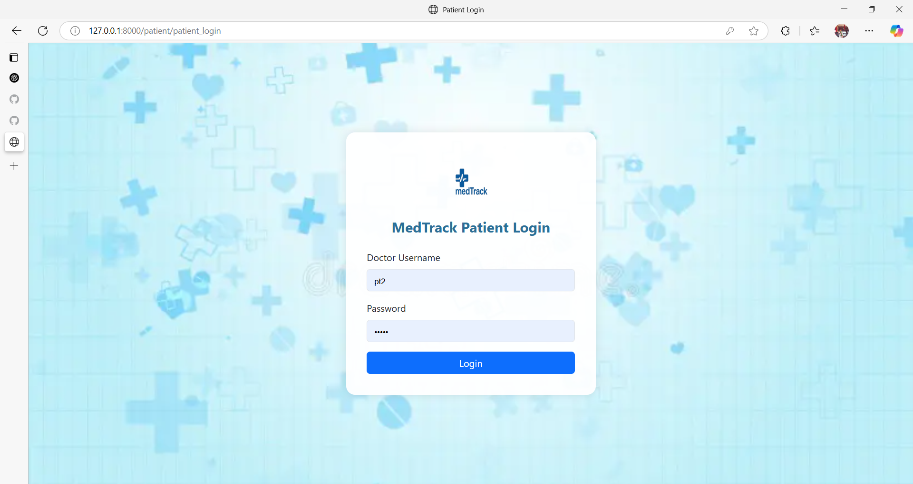
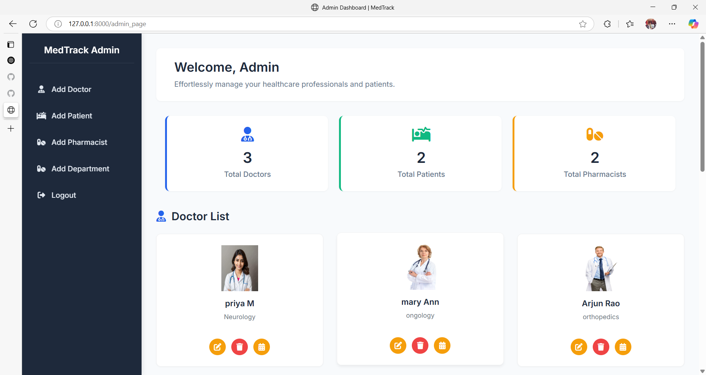
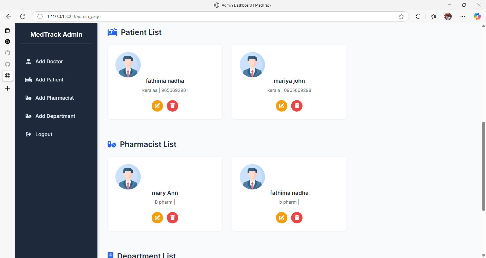
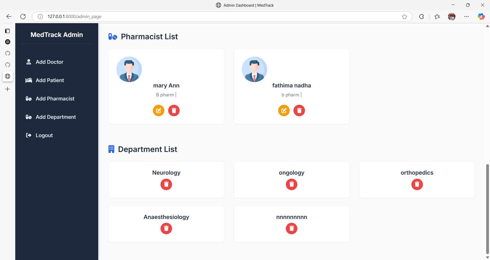
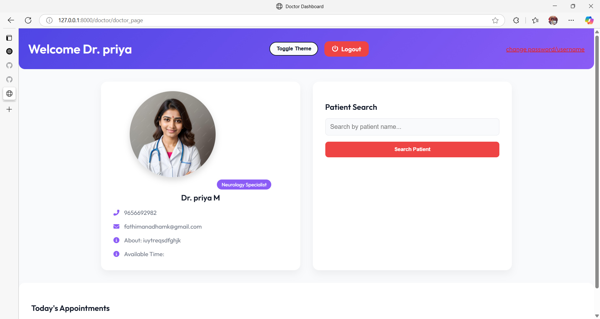
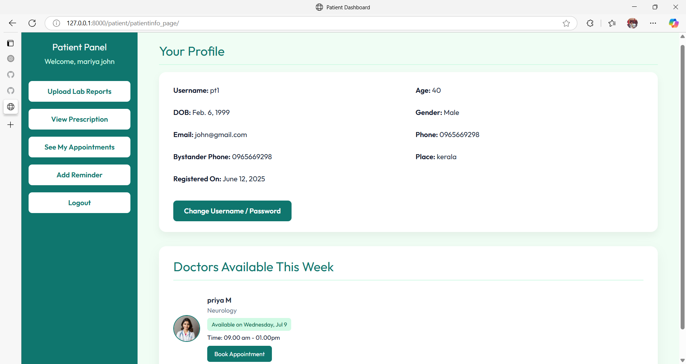
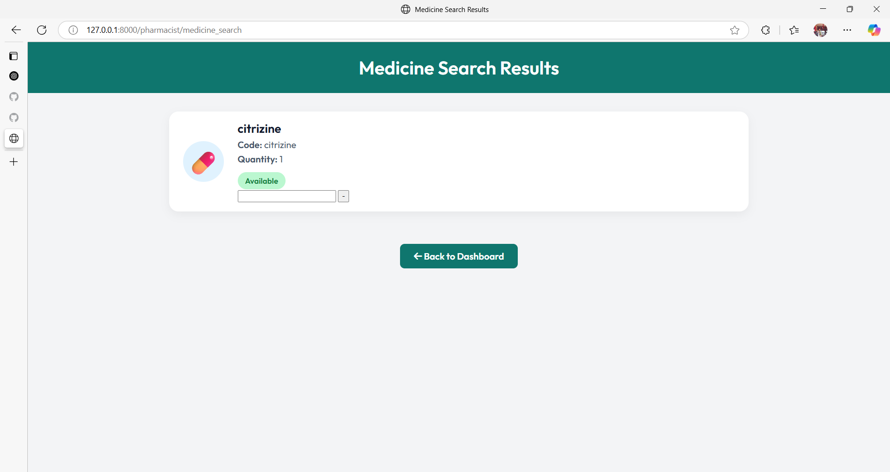

# 🏥 Hospital Management System

A full-stack web-based Hospital Management System built using **Django**, designed to streamline operations for hospitals by providing role-based access for Doctors, Patients, Pharmacists, and Administrators.

---

## 🚀 Features

- 🔒 Role-Based Access Control
- 🩺 Doctor dashboard & prescription updates
- 🧑‍🤝‍🧑 Patient appointments and history
- 💊 Pharmacist medication handling
- 📂 Admin-level user and system management

---

## 📸 Screenshots

### 🔐 Login Page


### 🏠 Admin Dashboard




### 👩‍⚕️ Doctor Dashboard



### 🧑 Patient Panel


### 🧑 Patient Panel



> Make sure your screenshots are stored in a folder named `screenshots/` in your repository root.

---

## 🧱 Tech Stack

- Django (Python), HTML, CSS, Bootstrap
- SQLite database

---

## 🛠️ Setup Instructions

```bash
git clone https://github.com/FathimaNadhaMK/HospitalManagement.git
cd HospitalManagement
python -m venv venv
venv\Scripts\activate  # Windows
pip install -r requirements.txt
python manage.py migrate
python manage.py createsuperuser
python manage.py runserver
